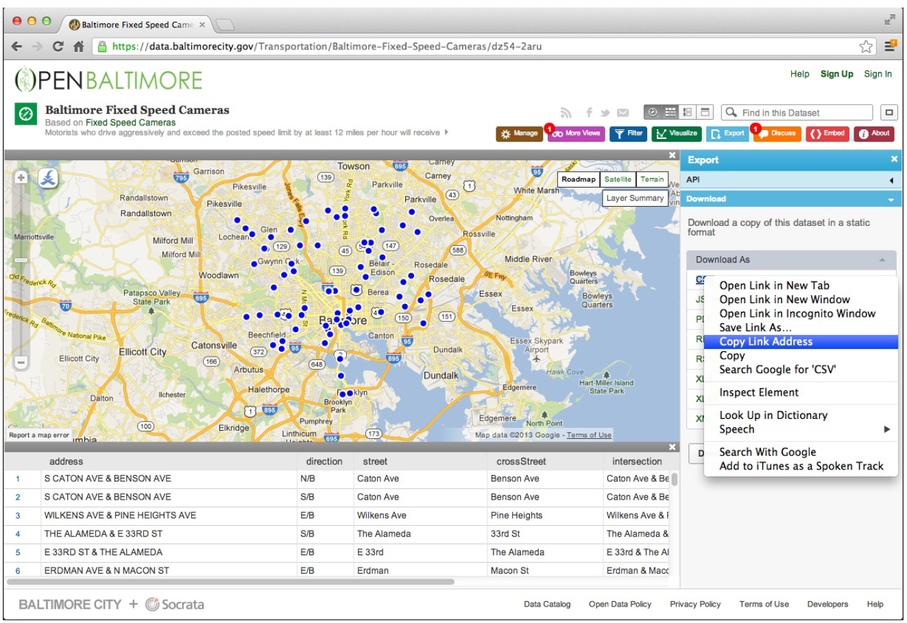

## Raw and Processed Data

>Defination

    " Data are values of qualitative or quantitative variables, belonging to a set of items."


+ "Variables"
+ "Qualitative / Quantitative"
+ "Set of items"

###   Raw data:

* The original source of the data
* Often hard to use for data analyses
* Data analysis **includes** processing
* Raw data may only need to be processed once
      
###   Processed data

* Data that is ready for analysis
* Processing can include merging, sub-setting, transforming, etc.
* There may be standards for processing
* All steps should be recorded.
      

## Components of tidy data

> Four things you should have:

* The raw data
    
* A tidy dataset
    
* A code book describing each variable and its values in the tidy data set.
    
    1. Information about the variables (including units) in the data set not contained in the tidy data
  2. Information about the summary choices you made
  3. Information about the experimental study design you used
  
  ----------
  + Commonly a word/txt file
  + There should be a section called "Study design" that has a thorough description of how you collected the data.
  + There must be a section called "Code book" that describes each variable and its units.


* A explicit and exact recipe you used to go for 1 -> 2,3

  + Ideally a computer script
  + The input for the script is the raw data
  + The output is the processed, tidy data
  + There are no parameters to the script
  


# Downloading Files

>working directory

* getwd(): getting working directory
* setwd(): setting working directory
  +       Relative: 
          setwd("./data") change the working directory into the data forlder
          serwd("../") change the working directory up into its father dirctory
  + Absolute: setwd("/User/jtleek/data")


* file.exists("directoryName"): check to see if the directory exists.
* dir.create("ditectoryName"): create a directory if it doesn't exist.

## **download.file()**:
* Downloads a file from the internet
* Helps with reproducibility
* Key parameters: *usl, destfile, method*
* Useful for tab-delimited, *csv*, and other files.

>Example: Baltimore camera data

1. Open the website of Open Baltimore, and get the camera files
2. Right click on the aim file and select "copy Link Adress"

3. copy the url into download.file()
```{r}
fileUrl<-"https://opendata.arcgis.com/api/v3/datasets/7055dbb02f0c4f14ab7ea3eb5ebfda42_0/downloads/data?format=csv&spatialRefId=3857"
download.file(fileUrl,destfile = "./cameras.csv")
list.files("./")
```
```{r}
dateDownloaded<-date()
dateDownloaded
```

# Reading Local Files

## read.table()
* It reads the data into RAM - big data can cause problems
* Key parameters: *file, header, sep, row.names, nrows*
  + *quote*: define how to deal with ' or " in the input
  + *na.string*: set the character for missing values
  + *nrows*: no. of rows to read
  + *skip*: no. of lines to skip before starting to read

```{r}
# cameraData <- read.table( "./cameras.csv")
#for read.table, the defalut seperation is tab while in csv files, it's commas.

cameraData <- read.table( "cameras.csv", sep = ",", header = TRUE, fill=TRUE)
head(cameraData)
```

# Reading Excel Files

## read.xlsx(), read.xlsx2() {xlsx package}
```{r}
library(xlsx)
cameraData<- read.csv("./cameras.csv", header =TRUE)
head(cameraData)
```
* read.xlsx2 is much faster than read.xlsx
* XL Connect has more options for writing and manipulating Excel files, informations can be found in XL Connect vignette

----------
