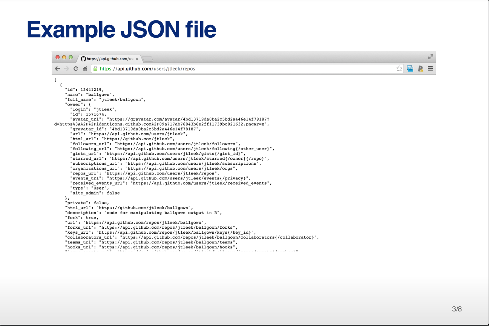

##JSON: *Jacascript Object Notation*

* Lightweight data storage
* Common format for data from Application Programming Interfaces (APIs)
* Similar structure to XML but different syntax/format
* Data stored as:
  - Numbers (double)
  - Strings (double quoted)
  - Boolean (T/F)
  - Array (ordered, comma separated enclosed in **[]** )
  - Object (unordered, comma seperated collection of key: value pairs in **{}**)

<Futher information> ( https://zh.wikipedia.org/wiki/JSON )


# Reading data from JSON {jsonlite package}

```{r}
library(jsonlite)
jsonData <- fromJSON ("http://api.github.com/users/jtleek/repos")
head(names(jsonData))
names(jsonData$owner)
jsonData$owner$login
```

# Writing data frames to JSON

```{r}
myjson<-toJSON(iris, pretty = TRUE)
#use cat() to print.
#cat(myjson)
```
## Convert back to JSON

```{r}
iris2<- fromJSON(myjson)
head(iris2)
```
